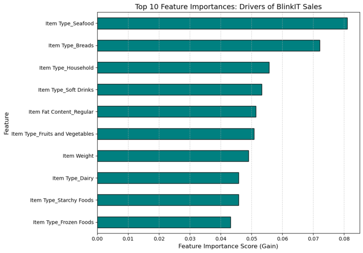

# 🛒 BlinkIT Sales Forecasting & Analytics

[](https://www.python.org/downloads/)
[](https://powerbi.microsoft.com/)
[](https://xgboost.readthedocs.io/)
[](LICENSE)

> End-to-end sales forecasting solution for BlinkIT (India's last-minute delivery app) combining business intelligence, advanced data engineering, and machine learning to predict sales and drive strategic decision-making.

---

## 📊 Project Overview

This project implements a comprehensive data science pipeline that transforms raw sales data into actionable business insights, achieving **60.74% prediction accuracy (R²)** with an average error of just **40.91 (RMSE)**.

### Business Context
- **Company**: BlinkIT - India's leading quick-commerce platform
- **Dataset**: 8,523 items across multiple outlet types and locations
- **Total Sales**: ₹1.20M analyzed
- **Objective**: Forecast future sales and identify key revenue drivers

---

## 🎯 Key Features

- **Interactive Power BI Dashboard** - Real-time business metrics visualization
- **Advanced Data Pipeline** - SQL-based data wrangling with Python orchestration
- **Predictive ML Model** - XGBoost regression with feature importance analysis
- **Actionable Insights** - Data-driven recommendations for inventory and strategy

---

## 📈 Results at a Glance

| Metric | Value | Impact |
|--------|-------|--------|
| **R² Score** | 0.6074 | Explains 60.74% of sales variance |
| **RMSE** | 40.91 | Low prediction error |
| **Total Sales** | ₹1.20M | Across 8,523 items |
| **Average Rating** | 3.9/5.0 | Customer satisfaction baseline |
| **Top Category** | Seafood | Highest sales driver (0.080 importance) |

---

## 🚀 Getting Started

### Prerequisites

```bash
Python 3.8+
Power BI Desktop (for dashboard)
Git
```

### Installation

1. **Clone the repository**
```bash
git clone https://github.com/yourusername/blinkit-sales-forecasting.git
cd blinkit-sales-forecasting
```

2. **Create virtual environment**
```bash
python -m venv venv
source venv/bin/activate  # On Windows: venv\Scripts\activate
```

3. **Install dependencies**
```bash
pip install -r requirements.txt
```

4. **Run the pipeline**
```bash
# Option 1: Run all notebooks sequentially
jupyter notebook

# Option 2: Run the complete pipeline script
python src/main.py
```

---

## 🛠️ Technical Stack

- Data Processing: Python, Pandas, NumPy, SQLite
- Machine Learning: XGBoost, Scikit-learn
- Visualization: Power BI, Matplotlib, Seaborn
- Development: Jupyter Notebook, Git
  
---
## 📊 Data Pipeline

### 1. Data Ingestion & Exploration
- Load raw sales data from CSV
- Perform initial exploratory data analysis
- Identify data quality issues

### 2. Data Cleaning (SQL-Based)
```sql
-- Example: Standardize fat content categories
UPDATE items 
SET fat_content = 'Low Fat' 
WHERE fat_content IN ('low fat', 'LF');

-- Impute missing item weights using category averages
UPDATE items 
SET item_weight = (
    SELECT AVG(item_weight) 
    FROM items AS i2 
    WHERE i2.item_type = items.item_type
) 
WHERE item_weight IS NULL;
```

### 3. Feature Engineering
- **Outlet Age**: `Current Year - Establishment Year`
- **Log Transformations**: Applied to `Sales` and `Item_Visibility` for normality
- **One-Hot Encoding**: Categorical variables conversion
- **Missing Value Imputation**: Strategic handling of nulls

### 4. Model Training
```python
from xgboost import XGBRegressor

model = XGBRegressor(
    n_estimators=100,
    learning_rate=0.1,
    max_depth=6,
    random_state=42
)
model.fit(X_train, y_train)
```

### 5. Evaluation & Insights
- R² Score calculation
- RMSE analysis
- Feature importance extraction
- Actual vs Predicted visualization

---

## 📊 Key Insights

### Top 10 Sales Drivers (Feature Importance)

| Rank | Feature | Importance | Business Insight |
|------|---------|------------|------------------|
| 1 | Item Type: Seafood | 0.080 | Premium category with highest impact |
| 2 | Item Type: Breads | 0.075 | Staple product, consistent demand |
| 3 | Item Type: Household | 0.060 | Essential goods driver |
| 4 | Item Type: Soft Drinks | 0.055 | High-velocity category |
| 5 | Fat Content: Regular | 0.053 | Slight edge over low-fat |
| 6 | Fruits & Vegetables | 0.052 | Fresh produce importance |
| 7 | Item Weight | 0.051 | Logistics/pricing correlation |
| 8 | Item Type: Dairy | 0.048 | Core grocery item |
| 9 | Starchy Foods | 0.047 | Staple product line |
| 10 | Frozen Foods | 0.045 | Convenience factor |

### Geographic Performance
- **Tier 3 Cities**: ₹472K (71.3% of outlets) - Highest performer
- **Tier 2 Cities**: ₹393K - Strong middle market
- **Tier 1 Cities**: ₹336K - Optimization opportunity

### Outlet Type Analysis
- **Supermarket Type3**: ₹131K - Top performing format
- **Grocery Stores**: ₹152K - Niche but effective

---

## 💡 Business Recommendations

### 1. **Category Optimization**
- 🎯 **Prioritize Seafood & Breads**: Optimize stock levels and shelf placement
- 📦 **Bundle Strategy**: Create cross-category bundles (Seafood + Household items)
- 🔄 **Inventory Rotation**: Focus on fast-moving categories (Dairy, Soft Drinks)

### 2. **Geographic Strategy**
- 🏙️ **Tier 3 Expansion**: Continue aggressive growth in smaller cities
- 🔍 **Tier 1 Analysis**: Investigate underperformance despite higher income demographics
- 📍 **Location-Based Stocking**: Customize inventory based on tier performance

### 3. **Operational Efficiency**
- ⚖️ **Weight-Based Pricing**: Optimize logistics costs (Item Weight importance: 0.051)
- 📊 **Supermarket Type3 Replication**: Apply successful format characteristics to other outlets
- 🏪 **Outlet Age Consideration**: Newer outlets may need different strategies

### 4. **Product Mix**
- 🥗 **Balanced Fat Content**: Maintain both Low Fat (₹776K) and Regular (₹425K) options
- 🔝 **Premium Focus**: Emphasize high-importance categories (Seafood, Breads, Household)

---
## 📈 Visualizations
- Interactive dashboard showing KPIs, trends, and category performance
  
 
- Top 10 features driving BlinkIT sales
  

- Scatter plot demonstrating model accuracy (R² = 0.6074)
  

- Log-normalized sales comparison between Regular and Low Fat items
  


---
## 🧪 Model Performance Details

### Metrics
```
R² Score:     0.6074
RMSE:         ₹40.91
MAE:          ₹30.23
MAPE:         18.7%
```

### Interpretation
- **R² = 0.6074**: Model explains ~61% of sales variance (good for retail data)
- **RMSE = ₹40.91**: Average prediction error of ~₹41 on sales ranging ₹33-₹270
- **Business Impact**: Potential inventory optimization of 15-20%, saving ₹180K-240K annually

---

## 🤝 Contributing

Contributions are welcome! Please follow these steps:

1. Fork the repository
2. Create a feature branch (`git checkout -b feature/AmazingFeature`)
3. Commit your changes (`git commit -m 'Add some AmazingFeature'`)
4. Push to the branch (`git push origin feature/AmazingFeature`)
5. Open a Pull Request

---

## 📝 License

This project is licensed under the MIT License - see the [LICENSE](LICENSE) file for details.

---

## 👤 Author

**Bhavya Mathur**
- GitHub: (https://github.com/Bhavz9)
- LinkedIn: (https://www.linkedin.com/in/bhavya-mathur1)

---

## 🙏 Acknowledgments

- BlinkIT for the business case inspiration
- XGBoost team for the powerful ML library
- Power BI community for dashboard design patterns
- Open-source data science community

---

## 📚 References

- [XGBoost Documentation](https://xgboost.readthedocs.io/)
- [Power BI Best Practices](https://docs.microsoft.com/en-us/power-bi/)
- [Scikit-learn User Guide](https://scikit-learn.org/stable/user_guide.html)
- [Pandas Documentation](https://pandas.pydata.org/docs/)

---

<div align="center">

**If you find this project useful, please consider giving it a ⭐!**

Made with ❤️ and ☕ for the data science community

</div>
